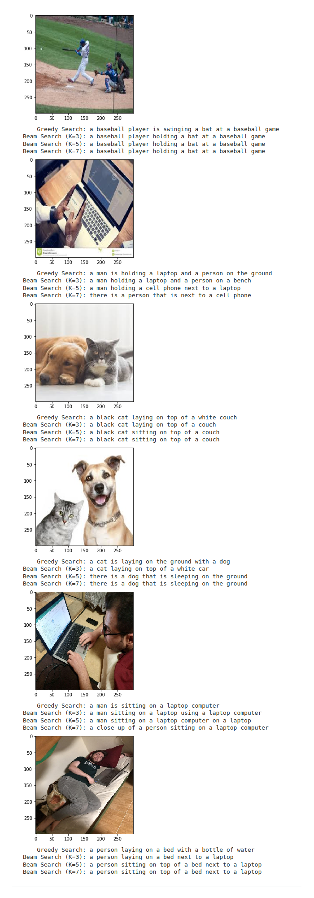

# attention-to-image-captioning
Image captionaning network based on an attention mechanism.

# Examples

# Train
To get the sense of the architecture of the model and the training procedure, check out the [Captioning-Jupyter-main](Captioning-Jupyter.ipynb) file.

# Inference
In order to inference, first save the trained model via [Captioning-Jupyter-main](Captioning-Jupyter.ipynb) and then check out the [Inference-Captioning-Jupyter](Inference-Captioning-Jupyter.ipynb) file.
